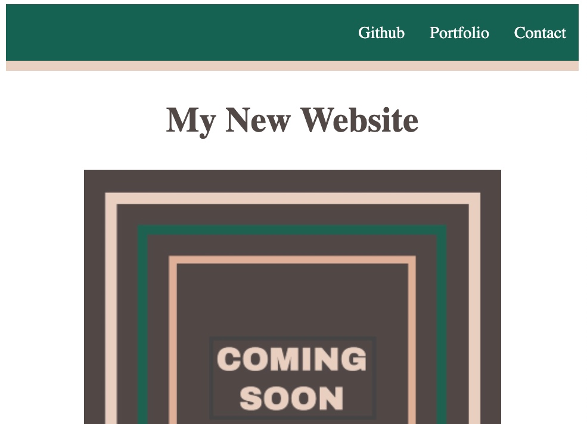

# Module-01-Project

## Description
The start of my webpage for contacting me. As of this moment, is mimicking the original outline to test my skills.

## Badges
NA

## Visuals

##  Installation
NA

## Usage
Used as a base for a contact me page. Will have links to Github and Portfolio, as well as an input section that eventually will email me directly so I can respond. file:///Users/mauryhughesivgmail.com/bootcamp/module-01-project/index.html

## Support
NA

## Roadmap
Will have a website to attract any potential employers.

## Contributing
NA

## Authors and acknowledgment
Base concept and pictures used from DU coding bootcamp.

## License
Please refer to LICENSE.

## Project status
In Progress.
Skeletal website and initial project complete. Want to expand and make it my own still.